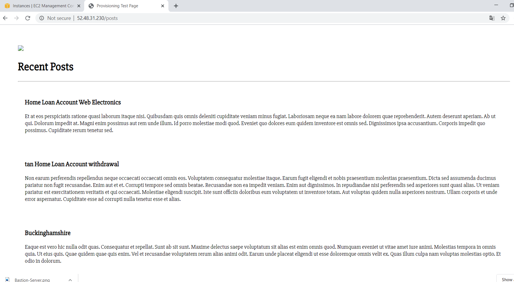

# Bastion 


## Things to remember 
- SSH into DB server
- ssh -i ~/.ssh/DevOpsStudents.pem ubuntu@123.45.2.181 # DB Private IP
- sudo apt-get install nginx
- add dh_host variable to the env 
- Unresolved Ip - cd ../../etc > sudo nano hosts > copyip above and ip-XXX-XXX-XXX
- ```bad interpretor``` dosunix provision.sh

# Instructions 

## Connecting to DB
1) Secure copy db folder from OS to bastion to DB
    ```
    scp -i ~/.ssh/DevOpsStudents.pem -r ~/PycharmProjects/Testing_VPC_Network_Via_App/environment/db/ ubuntu@52.48.31.230:/home/ubuntu/
    
   # SSh into the bastion to move the devops keys here
    scp -i ~/.ssh/DevOpsStudents.pem -r ~/PycharmProjects/Testing_VPC_Network_Via_App/environment/db/ ubuntu@123.45.2.181:/home/ubuntu/
    ```
   
1) SSH to the bastion 
    ```
    ssh -i ~/.ssh/DevOpsStudents.pem ubuntu@52.48.31.230
    ```
   
2) SSH to the DB 
   ```
    ssh -i ~/.ssh/DevOpsStudents.pem ubuntu@123.45.2.181
    ```
   
 3) Run the provision folder using ```./provision``` 


## Connecting to MongoDB through port 27017 on the App server 
1. Secure copy the app folder from OS to the App VM 
    ```
    scp -i ~/.ssh/DevOpsStudents.pem -r ~/PycharmProjects/Testing_VPC_Network_Via_App/app/ ubuntu@123.45.1.45:/home/ubuntu/
    ```
   
2. secure copy the environment/app/ folder to the app folder in the App VM
    ```
    scp -i ~/.ssh/DevOpsStudents.pem -r ~/PycharmProjects/Testing_VPC_Network_Via_App/environment/app/ ubuntu@5123.45.1.45:/home/ubuntu/
    ```
3. SSH into the app vm
    ```
    ssh -i ~/.ssh/DevOpsStudents.pem ubuntu@123.45.1.45
    ```
   
4. Navigate into the app folder where app.js resides
    ```apex
    cd app
    ./provision.sh
    ```
# Errors
If we run ```sudo apt-get install nginx``` the download will stay on 0% as the private NACL subnet doesn't allow inbound communication from internet

- This means the private NACL inbound access

Bastion connects to MY IP

cc ../..

cd /etc

## Diagram

```Key words``` : VPN, Bastion, IGW, Route Table, NACL, Security Groups 

# Connecting to DB # old notes to keep
```
ssh -i ~/.ssh/DevOpsStudents.pem ubuntu@ec2-54-216-111-231.eu-west-1.compute.amazonaws.com # -i $ ./provision.sh

export DB_HOST="mongodb://123.45.2.181:27017/posts" # db private hos
npm install 
```

# Notes
## Internet Gateway
### What is a VPC?
- A virtual private cloud (VPC) is your own private data center within the AWS infrastructure. 
- It is your own isolated segment of the AWS Cloud
- By default, when creating VPC, only your AWS account has access to it.
- There are millions of VPN but they do not have access to your VPC, vice versa.
- Since this is your network, you can decide to slice it up any way you prefer.

## VPNs
- Virtual Private Network.
- A VPN can allow users to exchange data efficiently across shared or public networks, as though they are directly linked to the private network

## IGWs
- An Internet Gateway is a managed component by AWS that is attached to your VPC and acts as a gateway between your VPC and the outside world.
- An IGW is a transparent component. It does not have an IP address of its own, and is not a component that you need to manage.
- **Note**: For an EC2 instance to talk to the outside world, instances must be located on a subnet that has a route defined to the IGW, **and** there must be a public IP address (Elastic IP - a reserved public IP address)
- This is **mandatory** to enable **bi-directional** communication between the outside world and the instances. 
- Serves as a bridge between our isolated VPC to the Internet by the IGW which is managed by AWS.
- Before the public subnet can access the Internet, we need to add a route to the public subnet's route table.
- Associated with every subnet when it is created will also be an associated route table.
- You can have the same route table associated to multiple subnets.
- You **cannot** associate more than one route table to a single subnet.

## NACLs (Network Access Control Lists) 
- Protects subnet
- Stateless
    - If instance in subnet sends request, the connection is not tracked, response is subject to NACL's inbound rules.
    - If traffic is allowed into subnet, the response is evaluated according to outbound rules
- Virtual network-level firewalls that are associated to each and every **subnet**
- Help control both ingress and egress (incoming, outbound) traffic moving in and out of your VPC and between your subnets.
- For example, an inbound rule might deny incoming traffic from a range of IP addresses, outbound rule might allow all traffic to leave the subnet.
- Optional but best solution is to use both resource types as virtual firewalls.

## SG Security Groups EC2
- Protects Instance
- Stateful
    - They automatically allow return traffic, no matter what rules are specified
    - If instance sends out a request, connection is tracked and the response is accepted regardless of inbound rules.
    - If traffic is allowed into instance, the response is allow out regardless of explicit outbound rules
    - SGs don't need rules to evaluate traffic because once a request is permitted, response is automatically permissed.
- Bastion and app server both in public subnet but different security groups, for example bastion server we only give access to our IP (22), app server we gave access to any IP address (port 80 and 443). In public NACL we granted internet to public subnet, however because our bastion server has a security group, traffic would not be allowed in.
- When creating a VPC, AWS automatically creates a default security group for it. 
- Firewall at EC2 level.
- Responsible for controlling the traffic in and out of your instances.
- Inbound rules **stateful**, meaning in an EC2 instance in an SG with port 80, incoming traffic is allowed, regardless of any rules.
- Outbound rules can respond to HTTP request but cannot initiate an HTTP request e.g to update server.

## Routing Table
- A **routing table** or **routing information base (RIB)**, is a data table stored in a router or a network host that lists the routes to particular network destinations.
- A set of rules, often viewed in table format, that is used to determine where data packets travelling over an IP will be directed.
- Routing table directs internet from IGW to our subnets.
- The place where routing information is stored 
- A routing table contains routing entries, which is a list of destinations (or a list of network prefixes or routes)
- In AWS, traffic within VPC does not need to be routed.
- The route tables are associated with each of your subnets to allow the flow of traffic according to the policies and options you have in place. 
- Each subnet in VPC must be associated with a route table, which controls routing for subnet.


## Proof


